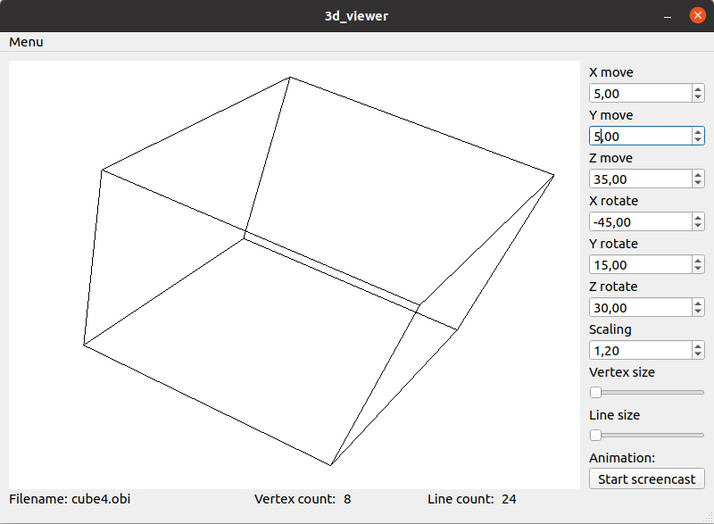
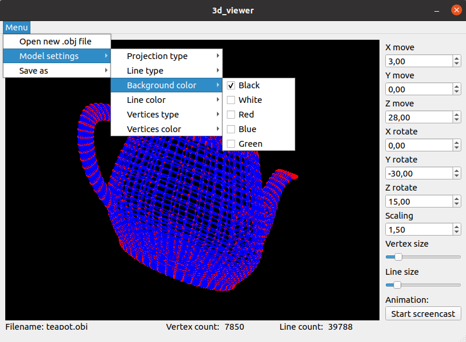
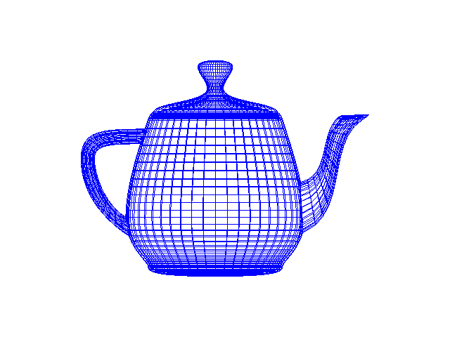
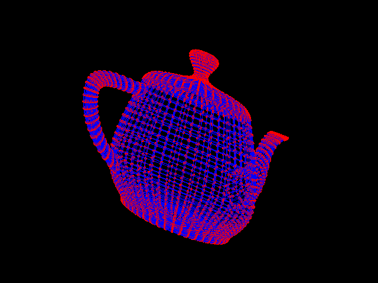

# 3DViewerQtOpenGL

Программа для просмотра 3D моделей в каркасном виде (3D Viewer) на языке программирования Си/C++ с использованием фреймворка Qt и графической библиотеки OpenGL. Модель необходимо загружать из файлов формата .obj и имеется возможность просматривать ее на экране с возможностью вращения, масштабирования и перемещения. 

### Описание

Программа предоставляет возможность:

- Загружать каркасную модель из файла формата obj (поддержка только списка вершин и поверхностей).

- Перемещать модель на заданное расстояние относительно осей X, Y, Z.

- Поворачивать модель на заданный угол относительно своих осей X, Y, Z

- Масштабировать модель на заданное значение.

- Видеть информацию о загруженной модели - название файла, кол-во вершин и ребер.

### Настройки

- Программа позволяет настраивать тип проекции (параллельная и центральная)

- Программа позволяет настраивать тип (сплошная, пунктирная), цвет и толщину ребер, способ отображения (отсутствует, круг, квадрат), цвет и размер вершин

- Программа позволяет выбирать цвет фона

- Настройки сохраняются между перезапусками программы

### Запись

Используется библиотека QtGifImage которая размещена в папке 3dviewer

- Программа позволяет сохранять полученные изображения в файл в форматах bmp и jpeg(в меню)

  
- Программа позволяет по специальной кнопке записывать небольшие "скринкасты" - текущие пользовательские аффинные преобразования загруженного объекта в gif-анимацию (640x480, 10fps, 5s) (запись начинается с нажатия кнопки и завершается по истечении времени)

## Сборка и тесты

Для запуска приложения необхожимо предварительно установить Qt и Opengl

Приложение было запущено и протестировано на Linux и MacOs

Покрытие unit-тестами вычислительных функций c помощью библиотеки check.h, unit-тесты покрывают не менее 80% кода

Предусмотрен Makefile для сборки библиотеки и тестов (с целями all, install, uninstall, clean, dvi, dist, tests, gcov_report)

- Цель install - установит программу в папку bin

- Цель uninstall - удалит программу

- Цель dvi - сгенерирует документацию в формате html и попытается открыть ее google-chrome, также сформирует отчет в форматах .pdf и .dvi и перенесет в текущую директорию 

- Цель dist - создает дистрибутив для распространения

- Цель gcov_report - сформирует отчёт о покрытии кода тестами в виде html страницы
